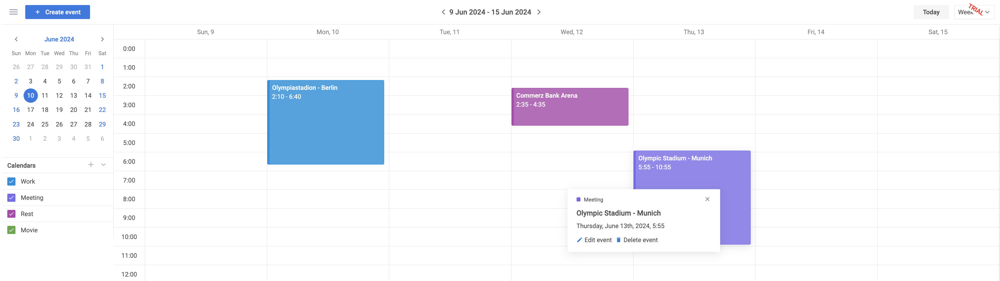

# Integration with React

:::tip
You should be familiar with the basic concepts and patterns of [**React**](https://react.dev) before reading this documentation. To refresh your knowledge, please refer to the [**React documentation**](https://reactjs.org/docs/getting-started.html).
:::

DHTMLX Event Calendar is compatible with **React**. We have prepared code examples on how to use DHTMLX Event Calendar with **React**. For more information, refer to the corresponding [**Example on GitHub**](https://github.com/DHTMLX/react-event-calendar-demo).

## Creating a project

:::info
Before you start to create a new project, install [**Vite**](https://vitejs.dev/) (optional) and [**Node.js**](https://nodejs.org/en/).
:::

You can create a basic **React** project or use **React with Vite**. Let's name the project as **my-react-event-calendar-app**:

~~~json
npx create-react-app my-react-event-calendar-app
~~~

### Installation of dependencies

Go to the new created app directory:

~~~json
cd my-react-event-calendar-app
~~~

Install dependencies and start the dev server. For this, use a package manager:

- if you use [**yarn**](https://yarnpkg.com/), run the following commands:

~~~json
yarn
yarn start
~~~

- if you use [**npm**](https://www.npmjs.com/), run the following commands:

~~~json
npm install
npm run dev
~~~

The app should run on a localhost (for instance `http://localhost:3000`).

## Creating Event Calendar

Now you should get the DHTMLX Event Calendar source code. First of all, stop the app and proceed with installing the Event Calendar package.

### Step 1. Package installation

Download the [**trial Event Calendar package**](/how_to_start/#installing-event-calendar-via-npm-and-yarn) and follow steps mentioned in the README file. Note that trial Event Calendar is available 30 days only.

### Step 2. Component creation

Now you need to create a React component, to add an Event Calendar into the application. Create a new file in the ***src/*** directory and name it ***EventCalendar.jsx***.

#### Import source files

Open the ***EventCalendar.jsx*** file and import Event Calendar source files. Note that:

- if you use PRO version and install the Event Calendar package from a local folder, the import paths look like this:

~~~jsx title="EventCalendar.jsx"
import { EventCalendar } from 'dhx-eventcalendar-package';
import 'dhx-eventcalendar-package/dist/event-calendar.css';
~~~

Note that depending on the used package, the source files can be minified. In this case make sure that you are importing the CSS file as **event-calendar.min.css**.

- if you use the trial version of Event Calendar, specify the following paths:

~~~jsx title="EventCalendar.jsx"
import { EventCalendar } from '@dhx/trial-eventcalendar';
import "@dhx/trial-eventcalendar/dist/event-calendar.css";
~~~

In this tutorial you can see how to configure the **trial** version of Event Calendar.

#### Setting the container and adding Event Calendar

To display Event Calendar on the page, you need to create the container for Event Calendar, and initialize this component using the corresponding constructor:

~~~jsx {2,6,9-10} title="EventCalendar.jsx"
import { useEffect, useRef } from "react";
import { EventCalendar } from "@dhx/trial-eventcalendar";
import "@dhx/trial-eventcalendar/dist/event-calendar.css"; // include Event Calendar styles

export default function EventCalendarComponent(props) {
    let container = useRef(); // initialize container for Event Calendar

    useEffect(() => {
        // initialize the Event Calendar component
        const calendar = new EventCalendar(container.current, {});

        return () => {
            calendar.destructor(); // destruct Event Calendar
        };
    }, []);

    return 

;
}
~~~

#### Loading data

To add data into the Event Calendar, you need to provide a data set. You can create the ***data.js*** file in the ***src/*** directory and add some data into it:

~~~jsx title="data.js"
export function getData() {
    return [
        {
            id: '27',
            type: 'work',
            start_date: new Date('2024-06-10T14:00:00'),
            end_date: new Date('2024-06-10T18:30:00'),
            text: ' Olympiastadion - Berlin ',
            details: ' Berlin, GER '
        },
        {
            id: '28',
            type: 'rest',
            start_date: new Date('2024-06-12T14:00:00'),
            end_date: new Date('2024-06-12T16:00:00'),
            text: ' Commerz Bank Arena ',
            details: ' Frankfurt, GER '
        },
        {
            id: '29',
            type: 'meeting',
            start_date: new Date('2024-06-13T11:00:00'),
            end_date: new Date('2024-06-13T16:00:00'),
            text: ' Olympic Stadium - Munich ',
            details: ' Munich, GER '
        }
    ];
}
~~~

Then open the ***App.js*** file and import data. After this you can pass data into the new created `<EventCalendar/>` components as **props**:

~~~jsx {2,5-6} title="App.js"
import EventCalendar from "./EventCalendar";
import { getData } from "./data";

function App() {
    const events = getData();
    return <EventCalendar events={events} date={new Date(2024, 5, 10)} />;
}

export default App;
~~~

Go to the ***EventCalendar.jsx*** file and apply the passed **props** to the Event Calendar configuration object:

~~~jsx {5,10-11} title="EventCalendar.jsx"
import { useEffect, useRef } from "react";
import { EventCalendar } from "@dhx/trial-eventcalendar";
import "@dhx/trial-eventcalendar/dist/event-calendar.css";

export default function EventCalendarComponent(props) {
    let container = useRef(); 

    useEffect(() => {
        const calendar = new EventCalendar(container.current, {
            events: props.events, // apply event data
            date: props.date,
            // other configuration properties
        });

        return () => {
            calendar.destructor();
        }
    }, []);

    return 

;
}
~~~

You can also use the [`parse()`](/api/methods/js_eventcalendar_parse_method/) method inside the `useEffect()` method of React to load data into Event Calendar:

~~~jsx {8-9,14} title="EventCalendar.jsx"
import { useEffect, useRef } from "react";
import { EventCalendar } from "@dhx/trial-eventcalendar";
import "@dhx/trial-eventcalendar/dist/event-calendar.css";

export default function EventCalendarComponent(props) {
    let container = useRef(); 

    let events = props.events;
    let date = props.date;

    useEffect(() => {
        const calendar = new EventCalendar(container.current, {});

        calendar.parse({ events, date });

        return () => {
            calendar.destructor();
        }
    }, []);

    return 

;
}
~~~

The `parse(data)` method provides data reloading on each applied change.

Now the Event Calendar component is ready to use. When the element will be added to the page, it will initialize the Event Calendar with data. You can provide necessary configuration settings as well. Visit our [Event Calendar API docs](/api/overview/properties_overview/) to check the full list of available properties.

#### Handling events

When a user makes some action in the Event Calendar, it invokes an event. You can use these events to detect the action and run the desired code for it. See the [full list of events](/api/overview/events_overview/).

Open ***EventCalendar.jsx*** and complete the `useEffect()` method in the following way:

~~~jsx {5-7} title="EventCalendar.jsx"
// ...
useEffect(() => {
    const calendar = new EventCalendar(container.current, {});

    calendar.api.on("add-event", (obj) => {
        console.log(obj);
    });
    
    return () => {
        calendar.destructor();
    }
}, []);
// ...
~~~

### Step 3. Adding Event Calendar into the app

To add the component into the app, open the **App.js** file and replace the default code with the following one:

~~~jsx title="App.js"
import EventCalendar from "./EventCalendar";
import { getData } from "./data";

function App() {
    const events= getData();
    return <EventCalendar events={events} date={new Date(2024, 5, 10)} />;
}

export default App;
~~~

After that, you can start the app to see Event Calendar loaded with data on a page.

Now you know how to integrate DHTMLX Event Calendar with React. You can customize the code according to your specific requirements. The final example you can find on [**GitHub**](https://github.com/DHTMLX/react-event-calendar-demo).
