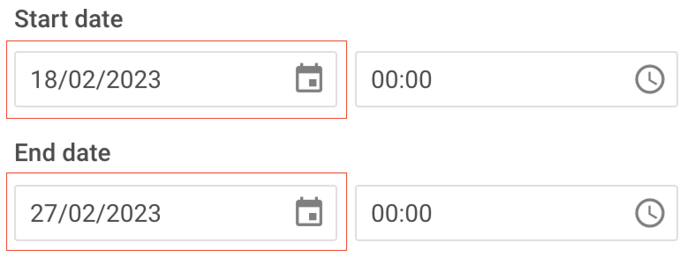

# How-tos

This page provides a full-fledged reference about initializing, configuring, customizing and working with JavaScript Event Calendar.

## Basic principles

In this section you can find out basic principles of work with Event Calendar

| Topic                        | Description                            |
| ---------------------------- | ---------------------------------------|
|  | Learn how to initialize Event Calendar |
|   | Learn how to configure Event Calendar  |
|   | Learn how to customize Event Calendar  |
|     | Learn how to stylize Event Calendar    |
|    | Learn how to localize Event Calendar   |

## API reference

In this section you can find out corresponding references of Event Calendar API

| Topic                                                              | Description                                        |
| ------------------------------------------------------------------ | -------------------------------------------------- |
| [Event Calendar inner events](api/overview/events_overview.md)     | Learn how to work with Event Calendar inner events |
| [Event Calendar methods](api/overview/methods_overview.md)         | Learn how to work with Event Calendar methods      |
| [Event Calendar properties](api/overview/properties_overview.md)   | Learn how to work with Event Calendar properties   |
| [Event Bus methods](api/overview/internal_eventbus_overview.md)    | Learn how to work with Event Bus methods           |
| [RestDataProvider methods](api/overview/rest_methods_overview.md)  | Learn how to work with RestDataProvider methods    |
| [State methods](api/overview/internal_state_overview.md)           | Learn how to work with State methods               |

## How to work with events

In these sections you can find out how to perform operations with events, work with events data and corfigure events

### Performing operations with events

| Topic                                                                | Description                                             |
| -------------------------------------------------------------------- | ------------------------------------------------------- |
| [Adding new events](api/methods/js_eventcalendar_addevent_method.md) | Learn how to add new events (without opening an editor) |
| [Creating new events](api/methods/js_eventcalendar_createevent_method.md)| Learn how to create new events and open an editor   |
| [Deleting events](api/methods/js_eventcalendar_deleteevent_method.md)| Learn how to delete events                              |
| [Updating events](api/methods/js_eventcalendar_updateevent_method.md)| Learn how to update events                              |

### Working with event data

| Topic                                                                      | Description                               |
| -------------------------------------------------------------------------- | ----------------------------------------- |
| [Getting event data](api/methods/js_eventcalendar_getevent_method.md)      | Learn how to get the event data by its ID |
| [Loading initial data](api/config/js_eventcalendar_events_config.md)       | Learn how to load the initial event data  |
| [Parsing event data](api/methods/js_eventcalendar_parse_method.md)         | Learn how to parse the event data         |
| [Serializing event data](api/methods/js_eventcalendar_serialize_method.md) | Learn how to serialize the event data     |

### Configuring events

| Topic                                                                   | Description                                                                          |
| ----------------------------------------------------------------------- | ------------------------------------------------------------------------------------ |
| [Creating events](api/config/js_eventcalendar_config_config.md)         | Learn how to enable/disable creating events (see the *readonly* parameter)           |
| [Creating events via dnd](api/config/js_eventcalendar_config_config.md) | Learn how to enable/disable creating events via dnd (see the *dragCreate* parameter) |
| [Creating events via double clicking](api/config/js_eventcalendar_config_config.md)| Learn how to enable/disable creating events via double clicking (see the *createEventOnDblClick* parameter)|
| [Resizing events via dnd](api/config/js_eventcalendar_config_config.md) | Learn how to enable/disable resizing events via dnd (see the *dragResize* parameter) |
| [Dragging (moving) events](api/config/js_eventcalendar_config_config.md)| Learn how to enable/disable dragging (moving) events (see the *dragMove* parameter)  |
| [Editing events](api/config/js_eventcalendar_config_config.md)          | Learn how to enable/disable editing events (see the *readonly* parameter)            |
| [Setting an events height](api/config/js_eventcalendar_config_config.md)    | Learn how to set a fix height of events (see the *eventHeight* parameter)        |
| [Setting an events time step](api/config/js_eventcalendar_config_config.md) | Learn how to set a time step when moving events (see the *timeStep* parameter)   |
| [Setting an events default duration](api/config/js_eventcalendar_config_config.md) | Learn how to set a time step when moving events (see the *defaultEventDuration* parameter)|
| [Setting an events positioning](api/config/js_eventcalendar_config_config.md)| Learn how to set positioning of events (see the *eventOverlay* parameter)       |
| [Customizing an events appearance](api/config/js_eventcalendar_templates_config.md)| Learn how to customize an event appearance using templates                |

## How to work with calendars (event types)

In these sections you can find out how to perform operations with calendars (event types), work with calendars data and corfigure calendars

### Performing operations with calendars (event types)

| Topic                                                                      | Description                    |
| -------------------------------------------------------------------------- | ------------------------------ |
| [Adding new calendars](api/methods/js_eventcalendar_addcalendar_method.md) | Learn how to add new calendars |
| [Deleting calendars](api/methods/js_eventcalendar_deletecalendar_method.md)| Learn how to delete calendars  |
| [Updating calendars](api/methods/js_eventcalendar_updatecalendar_method.md)| Learn how to update calendars  |

### Working with calendars (event types) data

| Topic                                                                   | Description                                      |
| ----------------------------------------------------------------------- | ------------------------------------------------ |
| [Loading initial data](api/config/js_eventcalendar_calendars_config.md) | Learn how to load the initial data for calendars |

### Configuring calendars (event types)

| Topic                                                                   | Description                                                                  |
| ----------------------------------------------------------------------- | ---------------------------------------------------------------------------- |
| [Editing calendars](api/config/js_eventcalendar_calendars_config.md)    | Learn how to enable/disable editing calendars (see the *readonly* parameter) |
| [Setting a calendar state](api/config/js_eventcalendar_calendars_config.md) | Learn how to set a calendar state (see the *active* parameter)           |
| [Setting a calendar color](api/config/js_eventcalendar_calendars_config.md) | Learn how to set a calendar color (see the *color* parameter)            |

## How to work with events editor

In this section you can find out how to work with an events editor

| Topic                                                                  | Description                                                                        |
| ---------------------------------------------------------------------- | ---------------------------------------------------------------------------------- |
| [Autosaving mode](api/config/js_eventcalendar_config_config.md)        | Learn how to enable/disable an editor autosave mode (see the *autoSave* parameter) |
| [Configuring an editor appearance](api/config/js_eventcalendar_editorshape_config.md) | Learn how to configure an editor appearance                         |
| [Updating editor settings](api/methods/js_eventcalendar_setconfig_method.md) | Learn how to update editor settings in a runtime                             |

### Configuring date format for editor fields

You can specify a custom date format for editor fields via the [`editorShape.config.format`](/api/config/js_eventcalendar_editorshape_config/#--parameters-for-a-date-type) property:

~~~jsx {6,15,24}
const editorShape = [
    {
        type: "date",
        key: "start_date",
        config:{
            format: "%d/%m/%Y", // you can specify any other format 
        },
        label: "Start date",
        time: true
    },
    {
        type: "date",
        key: "end_date",
        config:{
            format: "%d/%m/%Y", // you can specify any other format 
        },
        label: "End date",
        time: true
    },
    // other editor fields
];

new eventCalendar.EventCalendar("#root", {
    editorShape,
    // other configuration properties
});
~~~

:::tip
Explore the [**Format**](https://date-fns.org/v3.3.1/docs/format) topic for more information about available date formats!
:::

To get more information on how to configure the time and date format in the Event Calendar, refer to the [**Time and Date format**](/guides/localization/#time-and-date-format) section.

### Configuring editor fields at runtime

You have an ability to rebuild or modify editor form if a user fills input fields. For this purpose, you need to handle the ["edit-event"](/api/events/js_eventcalendar_editevent_event/) event as shown in the following code snippet:

~~~jsx {}
// The user dataset for Type 1
const users_dataset_1 = [
    { id: '1', label: 'Steve Smith', avatar: 'https://snippet.dhtmlx.com/codebase/data/kanban/01/img/user-1.jpg' },
    { id: '2', label: 'Aaron Long', avatar: 'https://snippet.dhtmlx.com/codebase/data/kanban/01/img/user-2.jpg' },
    { id: '3', label: 'Angela Allen', avatar: 'https://snippet.dhtmlx.com/codebase/data/kanban/01/img/user-3.jpg' },
    { id: '4', label: 'Angela Long', avatar: 'https://snippet.dhtmlx.com/codebase/data/kanban/01/img/user-4.jpg' }
];
// The user dataset for Type 2
const users_dataset_2 = [
    { id: '1', label: 'Steve Smith', avatar: 'https://snippet.dhtmlx.com/codebase/data/kanban/01/img/user-1.jpg' },
    { id: '2', label: 'Aaron Long', avatar: 'https://snippet.dhtmlx.com/codebase/data/kanban/01/img/user-2.jpg' }
];

// The dataset for Task Type selector
const task_types = [
    { id: 'type1', label: 'Type 1' },
    { id: 'type2', label: 'Type 2' }
];

// Specify configuration for Editor fields
const editorShapeConfig = [
    ...eventCalendar.defaultEditorShape,
    {   // The selector for task types
        type: 'combo',
        key: 'task_type',
        label: 'Task Type',
        options: task_types,
        config: { disabled: false, placeholder: "Select task type" }
    },
    {   // The selector for users. This selector changes its dataset depending on the selected Task Type
        type: 'multiselect',
        key: 'users',
        label: 'Users',
        options: users_dataset_1,
        template: optionTemplate,
        config: {
            disabled: false,
            placeholder: "Select user"
        }
    }
];

// The template that displays users in the Users selector
function optionTemplate(option) {
    return `

                
                ${option.label}
            
`
}

// Initialize Event Calendar
const calendar = new eventCalendar.EventCalendar('#root', {
    events, // Data for events
    editorShape: editorShapeConfig, // Configuration for editor fields
    mode: 'month',
    date: new Date('2024-12-01T00:00:00')
});

// Update the user dataset depending on the selected Task Type
function updateUsersBasedOnTaskType(shape, selectedType) {
    const updatedShape = shape.map(field => {
        if (field.key === 'users') {
            const options = selectedType === 'Type 2' ? users_dataset_2 : users_dataset_1;
            return { ...field, options };
        }
        return field;
    });
    return updatedShape
}

// Subscribe on the "edit-event" event
// If a user selects the Type 1, he can select 4 users in the Users selector
// If a user selects the Type 2, he can select 2 users in the Users selector
calendar.api.on("edit-event", (obj) => {
    setTimeout(() => {
        // Get the Editor form container
        const formContainer = document.querySelector('.wx-event-calendar-editor-form');

        if (formContainer) {
            const comboInput = document.querySelector('#combo_task_type');
            comboInput.addEventListener('focusout', () => {
                const newShape = updateUsersBasedOnTaskType(editorShape,comboInput.value)
                calendar.form.update(() => newShape )
            });
        }
    }, 0);
});

~~~

**Related sample:** [Event Calendar. Configuring editor fields at runtime](https://snippet.dhtmlx.com/22vzkltn?tag=event_calendar)

## How to work with inner events

| Topic                                                                          | Description                                               |
| ------------------------------------------------------------------------------ | --------------------------------------------------------- |
| [Executing inner events](api/internal/js_eventcalendar_exec_method.md)         | Learn how to execute the inner event                      |
| [Intercepting inner events](api/internal/js_eventcalendar_intercept_method.md) | Learn how to intercept the inner event                    |
| [List of inner events](api/overview/events_overview.md)                        | See the list of Event Calendar inner events               |
| [Reordering inner events](api/internal/js_eventcalendar_setnext_method.md)     | Learn how to add the inner event into the Event Bus order |
| [Subscribing on inner events](api/internal/js_eventcalendar_on_method.md)      | Learn how to subscribe on the inner event                 |

## How to work with view modes

In this section you can find out how to configure and customize view modes

### Configuring the hour scale in Day/Week views

The **hour height** of the time scale in **Day** and **Week** views is defined by the `--wx-event-calendar_hour-cell-height` css variable and can be specified in css:

~~~css
.wx-event-calendar{
    --wx-event-calendar_hour-cell-height: 100px !important;
}
~~~

This value can be modified at any time the event will adjust its position automatically and will be displayed at correct position relatively to the time scale.

The **hour width** of the time scale is defined by the `--wx-event-calendar_hour-scale-width` variable:

~~~css
.wx-event-calendar{
    --wx-event-calendar_hour-cell-width: 100px !important;
}
~~~

:::important
The ***!important*** directive is required for this style to work!
:::

## How to work with REST API

| Topic                                                                                     | Description                                        |
| ----------------------------------------------------------------------------------------- | -------------------------------------------------- |
| [Loading server data for events](api/provider/rest_methods/js_eventcalendar_getevents_method.md)       | Learn how to load server data for events           |
| [Loading server data for calendars](api/provider/rest_methods/js_eventcalendar_getcalendars_method.md) | Learn how to load server data for calendars        |
| [Working with server](guides/working_with_server.md)                                      | Learn how to work with server via REST API         |

## How to work with state

| Topic                                                                                             | Description                                             |
| ------------------------------------------------------------------------------------------------- | ------------------------------------------------------- |
| [Getting DataStore](api/internal/js_eventcalendar_getstores_method.md)                            | Learn how to get a DataStore object                     |
| [Getting StateStore properties](api/internal/js_eventcalendar_getstate_method.md)                 | Learn how to get an object of the StateStore properties |
| [Getting StateStore reactive properties](api/internal/js_eventcalendar_getreactivestate_method.md)| Learn how to get an object of the StateStore reactive properties |

## How to work with TypeScript

| Topic                                                       | Description                                        |
| ----------------------------------------------------------- | ---------------------------------------------------|
| [Working with TypeScript](guides/typescript_support.md)     | Learn how to work with TypeScript                  |

## Any questions left?

<button class="support_btn"><a href="https://forum.dhtmlx.com/">Ask the community</a> </button>

:::info
You can also leave your questions in the comments below!
:::
